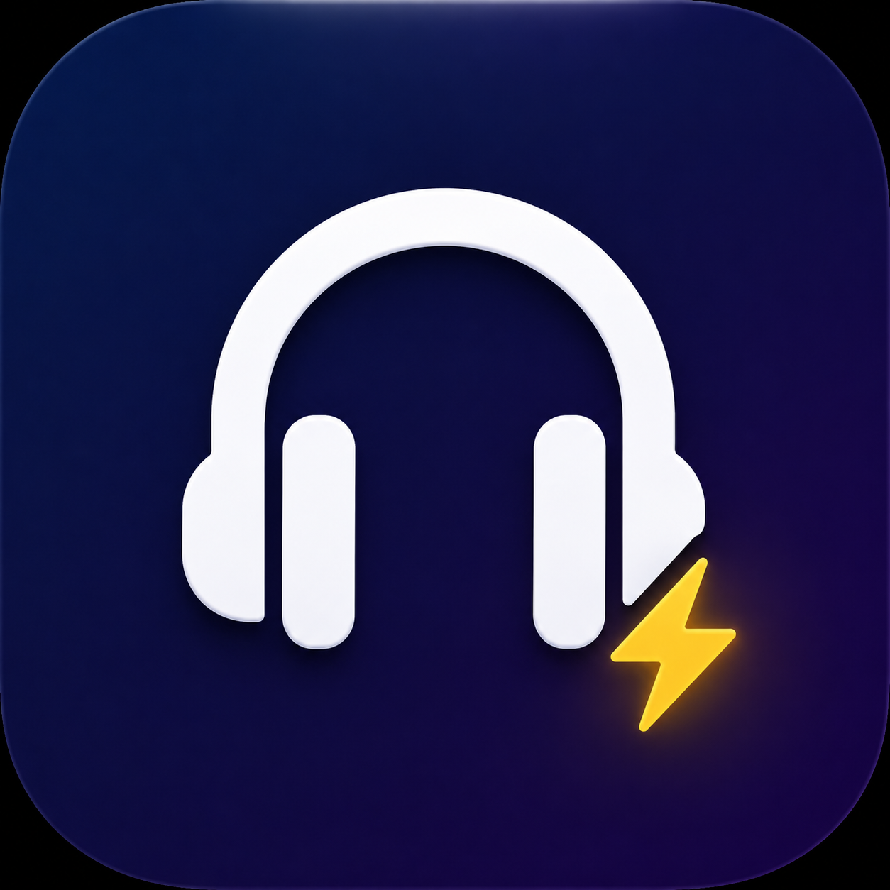

<div align="center">
  
  <h1>Clutch</h1>
  <p><strong>The menu bar app that saves your dignity.</strong></p>
</div>

<br>

## What is Clutch?

We've all been there. You're studying in a dead-silent library, or sitting in an open-plan office, and your Bluetooth headphones suddenly die or disconnect. Before you even realize what happened, your Mac blasts your music, game, or video to the entire room.

**Clutch** is a tiny, incredibly fast macOS menu bar utility that prevents this. The exact millisecond your headphones unplug or disconnect, Clutch instantly mutes your system audio. No jumpscares. No embarrassment. Just handled.

---

## 🎧 Features

Clutch is highly opinionated and comes with several modes tailored to specific levels of paranoia:

* **Normal Mode**: The default. Instantly mutes your speakers on unplug and sends you a silent pop-up notification letting you know it saved you.
* **Library Mode**: The nuclear option. Drops your system volume to exactly zero *before* muting it. Provides a double-layer of absolute silence for high-stakes public situations.
* **Call Mode**: Auto-detects conferencing apps (Zoom, Discord, Meet, FaceTime). If your headset dies, it mutes your speakers **and** your microphone input to prevent background noise from leaking into your meeting.
* **Parent Zone**: Pre-emptively warns you before you hit play on any audio if your family is nearby. 
* **Goblin Mode**: For the risk-takers. Tracks your highest-risk moments (based on volume and active app) and sends you a weekly chaos recap of your "close calls."
* **Stealth Mode**: Mutes silently. No notifications. No sounds. No evidence.

---

## 📦 Installation

### The Easy Way (Pre-compiled)
1. Head over to the [Releases](#) tab (or download the DMG from the `/dist` directory if available).
2. Download `Clutch.dmg`.
3. Open the DMG and drag `Clutch.app` into your Applications folder.
4. Launch the app and follow the quick onboarding!

### Build from Source
If you prefer to compile it yourself:
```bash
git clone https://github.com/anshull-saxena/Clutch.git
cd Clutch
./build.sh
```
The newly compiled app will be placed in the `dist` folder.

---

## ⚙️ How it Works

Unlike other apps that rely on slow AppleScript polling, Clutch binds directly to `CoreAudio` (`AudioObjectAddPropertyListenerBlock`). 

This means it operates at the lowest hardware level. When macOS detects an audio route change (e.g., your AirPods disconnecting, or the headphone jack being pulled), the C-level callback fires in under 40 milliseconds, muting the output channel before the audio buffer even has a chance to push the first frame of sound to your MacBook speakers.

**Privacy-first:** Clutch runs entirely locally, requires **zero accessibility permissions**, and never records or listens to your audio.

---

## 🤝 Contributing

Contributions are heavily welcomed! Whether it's a new fun mode, an aesthetic tweak, or a bug fix.

1. Fork the Project
2. Create your Feature Branch (`git checkout -b feature/AmazingFeature`)
3. Commit your Changes (`git commit -m 'Add some AmazingFeature'`)
4. Push to the Branch (`git push origin feature/AmazingFeature`)
5. Open a Pull Request

---

<div align="center">
  <p>Built with ❤️ and a crippling fear of public embarrassment.</p>
</div>
